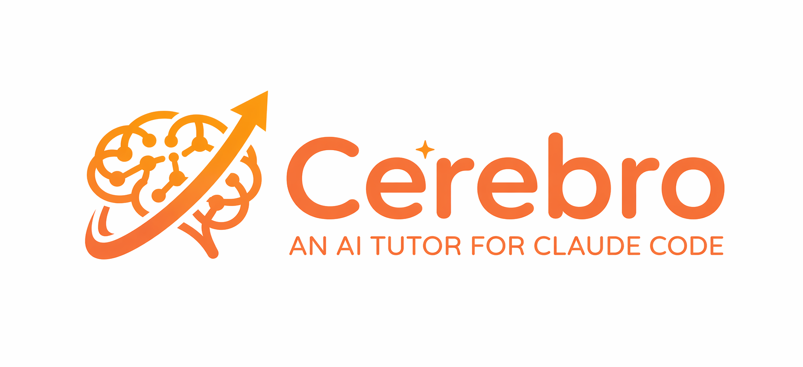

<p align="center">
  
</p>

<p align="center">
  AI-powered study ecosystem for <a href="https://claude.ai/claude-code">Claude Code</a>.<br>
  Transforms lecture recordings into exam-ready learning materials through a multi-skill pipeline.
</p>

## What It Does

Cerebro processes your lecture materials (video recordings, transcripts, slides, PDFs) and produces:

- **Flashcards** — Anki-ready TSV files following the Minimum Information Principle. One card = one idea. Backs are minimal, context is collapsible.
- **Interactive Mindmaps** — Dark-mode HTML files where every flashcard is visible as a Front → Back node pair. Category nodes show context tooltips on hover explaining concept relationships.
- **Coverage Analysis** — Compares generated flashcards against source materials, identifies gaps, and produces supplementary cards automatically.
- **Study Guides** — Comprehensive before-starting reports with concept architecture, exam relevance analysis, difficulty forecasts, and study strategies.
- **Mastery Testing** — Interactive conversational tests that adapt to your responses and identify weak spots.
- **Essay Scaffolding** — Skeleton answers for essay-format exams with word budgets, required points, and common mistakes to avoid.

## How It Works

Cerebro uses a **discovery-based agent architecture**. The tutor agent scans your `courses/` and `skills/` directories dynamically — no hardcoded course names or paths. Add a course folder and a matching flashcard skill, and the system picks it up automatically.

### The Pipeline

When new lecture materials arrive, the `lecture-ingest` pipeline runs 6 steps:

```
Video/Transcript → Whisper Transcription (skipped if transcript exists)
       ↓
    Lecture Summary (comprehensive narrative overview)
       ↓
    Flashcard Generation (course-specific skill, MIP-enforced)
       ↓
    Coverage Analysis (gap detection + supplementary cards)
       ↓
    Mindmap Generation (interactive HTML with context tooltips)
       ↓
    Before-Starting Report (exam analysis, difficulty forecast, study strategy)
```

Each step's output feeds the next. The before-starting report is generated last because it needs full knowledge of the final card set.

## Setup

### Prerequisites

- [Claude Code](https://claude.ai/claude-code) CLI installed
- Python 3.10+
- [Anki](https://apps.ankiweb.net/) with custom note types (see Card Types below)

### Installation

```bash
git clone https://github.com/serbestonline/Cerebro.git
cd Cerebro
pip install -r requirements.txt
chmod +x setup.sh && ./setup.sh
```

### Dependencies

| Package | Purpose | Required? |
|---------|---------|-----------|
| `openai-whisper` | Transcribe lecture video recordings to text | Only if you have video files without transcripts |
| `PyMuPDF` | Extract images and render PDF pages | Optional — for future image extraction features |

If you already have lecture transcripts (`.txt` files), Whisper is not needed — the pipeline skips transcription when a transcript exists.

#### Whisper Setup Notes

Whisper requires `ffmpeg`:

```bash
# macOS
brew install ffmpeg

# Ubuntu/Debian
sudo apt install ffmpeg
```

The pipeline uses Whisper's `small` model by default:

```bash
whisper "lecture.m4v" --model small --language en --output_format txt --condition_on_previous_text False --fp16 False
```

You can use a larger model (`medium`, `large`) for better accuracy at the cost of speed. Change the model in `skills/lecture-ingest.md` if needed.

### Directory Structure

```
Cerebro/
├── AGENT.md                          # Tutor agent — orchestrates everything
├── README.md
├── .gitignore
│
├── skills/                           # Core skills
│   ├── flashcard-generator.md        # Central rules: MIP, card types, tags, TSV format
│   ├── lecture-ingest.md             # 6-step processing pipeline
│   ├── lecture-summary.md            # Summaries + before-starting reports
│   ├── flashcard-coverage-checker.md # Gap analysis + supplementary cards
│   ├── mindmap-generator.md          # Interactive HTML mindmaps
│   ├── lecture-mastery-tester.md     # Conversational mastery testing
│   ├── essay-scaffolder.md           # Essay skeleton answers
│   ├── weak-spot-hunter.md           # Anki performance analysis
│   └── flashcard-generators/         # Course-specific skills
│       └── (your course skills here)
│
├── assets/                           # Reference files
│   └── mindmap_reference.html        # Working mindmap example
│
├── .claude/
│   └── commands/                     # Slash commands (symlinks to skills)
│       ├── lecture-ingest.md
│       ├── lecture-summary.md
│       ├── flashcard-coverage.md
│       ├── mindmap.md
│       ├── mastery-test.md
│       ├── essay-scaffold.md
│       └── weak-spots.md
│
└── courses/                          # YOUR course folders (gitignored)
    └── (your courses here)
```

### Setting Up Slash Commands

The `.claude/commands/` directory contains symlinks to skill files. If you cloned the repo, the symlinks may be broken. Recreate them:

```bash
cd Cerebro
mkdir -p .claude/commands
ln -sf ../../skills/lecture-ingest.md .claude/commands/lecture-ingest.md
ln -sf ../../skills/lecture-summary.md .claude/commands/lecture-summary.md
ln -sf ../../skills/flashcard-coverage-checker.md .claude/commands/flashcard-coverage.md
ln -sf ../../skills/mindmap-generator.md .claude/commands/mindmap.md
ln -sf ../../skills/lecture-mastery-tester.md .claude/commands/mastery-test.md
ln -sf ../../skills/essay-scaffolder.md .claude/commands/essay-scaffold.md
ln -sf ../../skills/weak-spot-hunter.md .claude/commands/weak-spots.md
```

Or run the setup script:

```bash
chmod +x setup.sh && ./setup.sh
```

After setup, open Claude Code in the Cerebro directory. Type `/` to see available commands.

> **Note:** These are project-level commands — they only appear when Claude Code's working directory is inside the Cerebro folder. They do not pollute your global commands.

### Adding Your Courses

1. Create a folder under `courses/`:

```
courses/
└── My Course Name/
    └── 01.01.26 - Lecture 1/
        ├── lecture_video.m4v        # or .mp4, .mov
        ├── lecture_slides.pdf
        └── reading_material.pdf     # optional
```

2. Create a course-specific flashcard skill in `skills/flashcard-generators/`:

```markdown
---
name: my-course-flashcards
description: Generate Anki flashcards from [Course Name] lecture materials. [Brief description of what makes this course unique.]
inherits: ../flashcard-generator.md
---

# My Course Flashcards

**Course:** [Full course name]
**Deck:** User selects during Anki import — do not hardcode in TSV

## Exam Format
[Describe the exam: MCQ? Essay? Definitions? How many questions? Word limits?]

## Input Materials
[What files does this course provide? PDF slides? RMD files? PPTX?]

## Card Types for This Course
[Which card types are emphasized? Any course-specific card rules?]

## Coverage Verification
[What must be checked before finalizing output?]
```

3. The agent discovers the new course automatically. Run the pipeline:

```
/lecture-ingest
```

### Output Per Lecture

After processing, each lecture folder contains:

```
01.01.26 - Lecture 1/
├── lecture_video.m4v                    # original (untouched)
├── lecture_video.txt                    # whisper transcript
├── lecture_slides.pdf                   # original (untouched)
├── lecture_summary.md                   # comprehensive summary
└── Flashcards/
    ├── flashcards.tsv                   # main flashcard deck
    ├── flashcards_supplementary.tsv     # gap-filling cards (if needed)
    ├── flashcard_mindmap.html           # interactive mindmap
    └── before_starting_report.md        # study guide
```

## Card Types

Cerebro uses custom Anki note types:

| Type | Fields | Use Case |
|------|--------|----------|
| **Cerebro Basic** | Front, Back, Context, Image | Standard Q&A — definitions, mechanisms, comparisons |
| **Cerebro Cloze** | Text, Context, Image | Fill-in-the-blank — terms, dates, formulas |
| **Cerebro Type** | Front, Back, Context, Code, Image | Type-your-answer — active recall |
| **Cerebro Type Code** | Front, Back, Context, Code, Image | Type code — IDE-style interface for programming courses |

Card templates (HTML front, back, styling, and field definitions) are in `assets/card-templates/`. To set up in Anki:

1. Create a new note type in Anki (Tools → Manage Note Types → Add)
2. Name it exactly as shown (e.g., `Cerebro Basic`)
3. Add the fields listed in the corresponding `*-fields.html` file
4. Paste the front template from `*-front.html`, back from `*-back.html`, and styling from `*-styling.html`
5. Repeat for each card type you need

### Key Design Principles

**Minimum Information Principle:** Every card tests exactly one idea. Backs are 10-15 words max. Extended explanations go in the collapsible Context field.

**Cloze Overview Pattern:** Lists of 3+ items always produce a Cloze Overview card (big picture with gaps) PLUS individual Basic cards for each item.

**3-Tier Tagging:**
- **Tier 1 (Domain):** Cross-course themes — `memory`, `attention`, `statistics`
- **Tier 2 (Week):** `Week-1`, `Week-2`, etc.
- **Tier 3 (Concept):** Specific concept — `dualism`, `t-test`, `prosopagnosia`

## Slash Commands

When working in the Cerebro directory with Claude Code, these commands are available:

| Command | What It Does |
|---------|-------------|
| `/lecture-ingest` | Run the full 6-step pipeline on a lecture |
| `/lecture-summary` | Generate lecture summary + study guide |
| `/flashcard-coverage` | Analyze coverage gaps + generate supplementary cards |
| `/mindmap` | Generate interactive flashcard mindmap |
| `/mastery-test` | Interactive conversational mastery test |
| `/essay-scaffold` | Generate essay skeleton answers |
| `/weak-spots` | Analyze Anki review data for weak areas |

## Example Skills

The repo includes 4 example course-specific skills in `skills/flashcard-generators/`:

| Skill | Course Type | Exam Format | Key Feature |
|-------|-------------|-------------|-------------|
| `clinical-neuro-flashcards.md` | Clinical Neuropsychology | Essay + definitions | Glossary extraction, practice essay questions |
| `compneuro-flashcards.md` | Computational Neuroscience | MCQ only | MCQ generation (20-25/lecture), when-to-use cards |
| `affective-neuro-flashcards.md` | Affective Neuroscience | Scenario-based | Brain region ↔ function mapping, scenario practice |
| `r-programming-flashcards.md` | Statistics / R Programming | Mixed | Dual-layer input (RMD + PPTX), Cerebro Type Code 70-85% |

These serve as templates. Copy one that matches your course type and adapt it.

## Mindmap Preview

Open `assets/mindmap_reference.html` in a browser to see the interactive mindmap format:

- Dark mode interface
- Every flashcard visible as Front → Back nodes
- Category nodes show CONTEXT tooltips on hover
- Click to expand/collapse branches
- Color-coded theme branches

## Contributing

1. Fork the repo
2. Add your course-specific flashcard skill
3. Test it with real lecture materials
4. Submit a PR with the skill file (no course data)

## License

MIT
